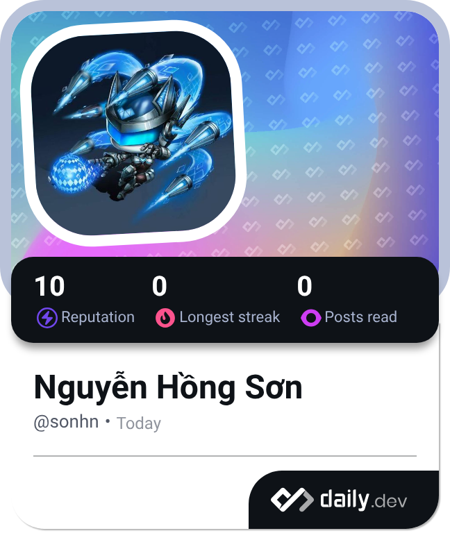

  

  

    
  

  

    
    
    
    
  

  

    
    
    
    
  

  

    
    
  

  

    
  

  

    
  

---

  
<b>👋 About</b>

- **Mình là**: Sơn — Frontend developer, ưu tiên UI/UX “sạch”, component hoá và trải nghiệm mượt.
- **Đang học**: **React** / **TypeScript** / best practices để code dễ scale và dễ bảo trì.
- **Quan tâm**: design system, performance, DX, và build toolchain.

  
<b>🧰 Tech stack</b>

  
<b>⚛️ Frontend</b>

  

    
  

  
<b>🎨 UI / Styling</b>

  

    
  

  
<b>🛠️ Tools</b>

  

    
  

  
<b>🧩 Backend / API</b>

  

    
  

  
<b>🕹️ Other</b>

  

    
  

  
<b>🏆 Trophy / Streak</b>

  

  

  
<b>📊 Stats</b>

  
  

  
<b>📬 Contact</b>

- **Email**: [nhson.codes@gmail.com](mailto:nhson.codes@gmail.com)
- **Telegram**: [t.me/Nguyensonfs](https://t.me/Nguyensonfs)
- **Facebook**: [facebook.com/hongsonjs](https://www.facebook.com/hongsonjs/)

